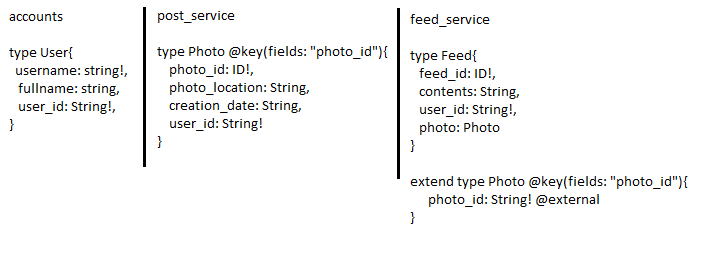
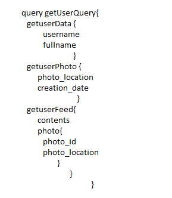
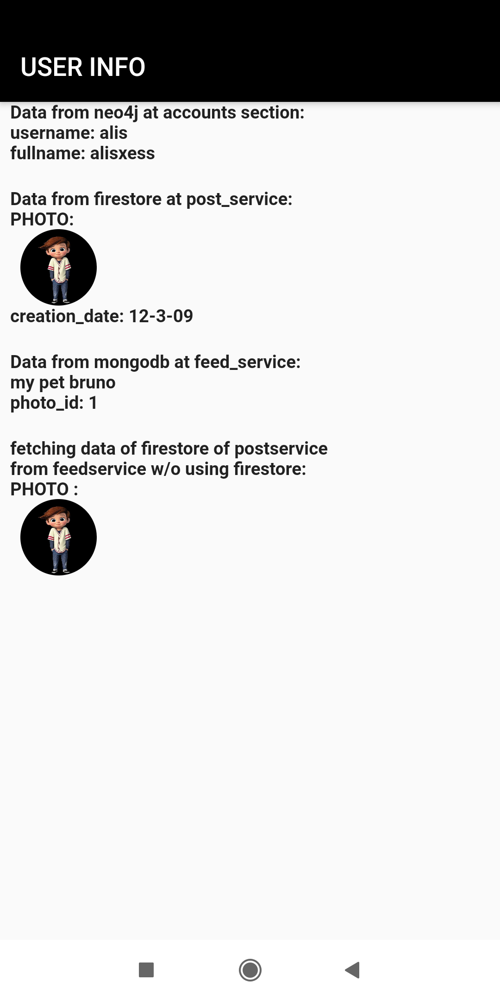

# Apollo_fed_example

This microservices based application is an example of apollo federation which uses multiple different types of databases(polyglot persistence).

## Getting Started
Frontend - is a flutter application which uses firebase authentication for users.
&
Backened has an apollo federated gateway which consists of 3 subgraphs for 3 different microservices:
1) Accounts :- For maintaining user's personal details. This service uses Neo4j database .
2) Posts :- This service is used when users want to upload photos and videos , so the record will contain photo-location, creation date, photo id etc. This service uses Google                 Firestore.
3) Feeds :- This service is used when users want to see their uploaded posts or other's uploaded posts. This service uses MongoDB database. 

Backened has following graphQL schema:

Each subgraph defines the types and fields that it is capable of (and should be responsible for) populating from its own back-end data store.

Here feed_service's subgraph referenced an entity Photo from post_service's subgraph. 
Because the Photo entity is defined in another subgraph, the feed_service subgraph needs to define a stub of it to make its own schema valid. The stub includes just enough 
information for the subgraph to know how to interact with a Photo: like keywords- "extend", "@key" & keyfield-"photo_id".

So if we query like this,

 
 
 OUTPUT:
 
 
 
 accounts_services fetches getuserData query fields, post_service fetches getuserPhoto fields and feed_service fetches getuserFeed fields.
 The gateway fetches the required "photo_id" and "photo_location" fields of getuserFeed query from the post_service subgraph and passes it to the feed_service subgraph.
 
 So this way an apollo federated gateway implements polyglot persistence model.

